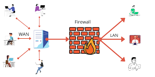
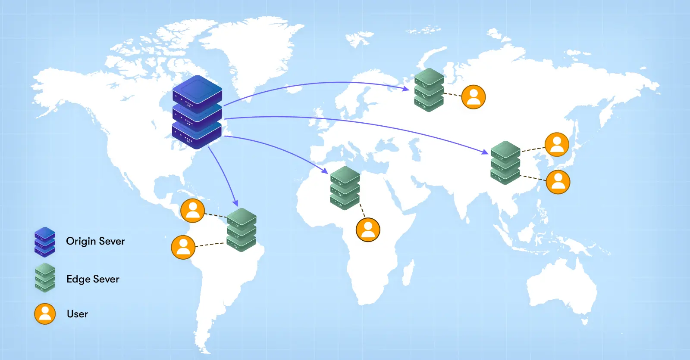

# When-you-type-google.com-into-browser

Have you ever wondered what goes on behind the scenes when you enter a URL in your browser and navigate to your favorite websites? How does the webpage magically appear when you press enter after typing in the URL? And how are the images and content displayed on the page? It may seem like a simple and quick process, but in reality, loading a website involves a complex infrastructure.

When you type "google.com" into your browser’s address bar and hit enter, a series of complex processes are triggered behind the scenes, resulting in the webpage loading and you being able to start searching. While the entire process is highly optimized and happens in milliseconds, it involves several key steps. Let’s break down what happens in a bit of technical detail.

 ## 1. Domain Name System (DNS) Lookup  
When you type "google.com" in your browser's address bar and press enter, it initiates a series of events known as DNS (Domain Name System) resolution. This process involves converting the human-readable domain name, such as "google.com," into a computer-friendly IP address (like 192.168.1.1), which informs your browser which server to communicate with.

The first step begins with resolving the human-readable domain name "google.com" into an IP address, which is necessary for communication over the internet. Here’s how it happens:

1.  **User Input:** A user enters 'google.com' into a web browser, and the query travels into the Internet and is received by a DNS recursive resolver. This resolver is usually provided by our Internet Service Provider (ISP).
2.  **Query to Root Nameserver:** If the resolver doesn't find the IP in its cache, it queries a DNS root nameserver.
3.  **Response from Root Server:** The root server responds to the resolver with the address of a Top-Level Domain (TLD) server that stores information for its respective domains. In this case, the TLD is '.com', while other examples include '.net', '.fr', and so on.
4.  **Query to TLD Server:** The resolver then makes a request to the '.com' TLD server.
5.  **Response from TLD Server:** The TLD server responds with the IP address of the domain's authoritative name server, "google.com". Usually, there is more than one name server attached to a single domain name.
6.  **Query to Authoritative Name Server:** The resolver sends a query to the domain's authoritative name server.
7.  **Response from Authoritative Name Server:** The IP address for "google.com" is returned to the resolver from the authoritative name server.
8.  **DNS Resolver Response:** The DNS resolver then responds to the web browser with the IP address of the initially requested domain.
9. **HTTP Request and Response:** An HTTP request is made by the browser to the IP address, and in response, the server at that IP address returns the webpage to be rendered in the browser.

    

+   Additional requests may be necessary to locate the correct IP address if the DNS record is not found at any of the name servers or if the record has been configured to use services like DNS load balancing or content delivery networks (CDN).
+   Once the IP address has been successfully resolved, it is cached by the local DNS resolver and the browser to improve the speed of future requests to the same domain name.
+   The length of time that the DNS record is cached, known as the "Time To Live" (TTL), is determined by the authoritative nameserver and can be adjusted by the domain owner to balance the need for fast response times.

## 2. TCP/IP Connection

Once the IP address is obtained, your browser establishes a connection to the Google servers using the Transmission Control Protocol (TCP) over Internet Protocol (IP).

The TCP/IP (Transmission Control Protocol/Internet Protocol) is the common protocol used for various types of HTTP requests. It functions as a set of rules governing the format of data transmitted over the internet or local network, enabling activities such as sending emails, streaming videos, or connecting to a website. 

The TCP/IP model enhances the integrity of each communication by breaking down data into smaller packets and then reassembling them into the complete message on the receiving end. This approach of sending data in manageable packets enhances accuracy compared to transmitting all the data at once.

Some of the common protocols that work in conjunction with the TCP/IP model include HTTP, FTP, and SMTP. These protocols play vital roles in facilitating web browsing, file transfers, and email communication, respectively. 

By using the TCP/IP model in conjunction with various protocols, the internet achieves seamless and reliable data transmission, enriching our online experiences.In a nutshell, IP is responsible for locating the proper path for delivering packets. 

TCP is responsible for end-to-end delivery and the correction of errors on that path.

 **This involves:**

+ **Three-Way Handshake:** A TCP connection is established through a process known as the three-way handshake:

    + **SYN:** Your browser sends a synchronization packet (SYN) to Google’s server.

    + **SYN-ACK:** The server responds with a synchronization-acknowledgment (SYN-ACK) packet.

    + **ACK:** Finally, your browser sends an acknowledgment (ACK) packet back to the server, establishing the connection.

At this point, your browser and the Google server are ready to exchange data.


 ## 3. SSL/TLS Handshake
Given that Google uses HTTPS for secure communication, an SSL/TLS handshake occurs next:

+    **ClientHello:** Your browser sends a ClientHello message to the server, including details like supported SSL/TLS versions and cipher suites.

+    **ServerHello:** The server responds with a ServerHello message, selecting the SSL/TLS version and cipher suite.

+    **Certificate Exchange:** Google’s server sends its SSL/TLS certificate, which your browser validates to ensure the authenticity of the server.

+    **Session Keys:** Both the browser and the server generate session keys for encrypting the data that will be transmitted.


With the TCP connection established, the data transfer can begin! But before we proceed, we need some traffic control – introducing the load balancer...


**A Load Balancer** plays a vital role in evenly distributing incoming traffic across multiple servers, ensuring that no single server is overloaded. This intelligent distribution not only enhances website performance but also prevents server crashes, resulting in a more reliable browsing experience.

For high-traffic websites like "google.com," load balancing becomes crucial to maintain optimal performance and handle the enormous number of requests effectively. When a user's request arrives, the load balancer assigns it to a specific server, repeating this process for every subsequent request. 

Various algorithms guide load balancers in determining which server should handle each incoming request.

Now, while the load balancer efficiently manages the incoming traffic, let's ensure the network remains secure with the assistance of a firewall.



A firewall serves as a network security system, actively filtering incoming and outgoing network traffic based on pre-defined rules. It acts as a protective barrier against unauthorized access, shielding the servers from potential threats such as hackers and malware.

When you type a URL like "google.com" in your browser, the request passes through a firewall, which carefully inspects the incoming traffic to ensure it adheres to the established security rules. 

These rules can include restrictions on the requesting IP address, the frequency and number of requests, or even the type of content being sought.

Additionally, some browsers come equipped with built-in firewalls that can detect potential malicious agents based on the IP obtained from the DNS request.

## HTTPS/SSL: Emphasizing Secure Connections

Having obtained the IP address, the browser now shifts its focus to the other part of the URL, the "https://" part

HTTPS, which stands for HyperText Transfer Protocol Secure, is an upgraded and secure version of the standard HTTP. It plays a critical role in safeguarding sensitive data exchanged between a web server and a user's browser, making it difficult for attackers to intercept and steal information like login credentials and payment details.


**SSL,** or Secure Sockets Layer (also known as TLS, Transport Layer Security), is a set of encryption protocols used to secure the data transmitted over HTTPS. This protocol ensures secure communications through an asymmetric public key infrastructure. Such a security system relies on two distinct keys for encrypting communications:

+   **Private Key:** Controlled by the website owner, the private key resides on the web server and is used to decrypt information that was previously encrypted by the public key.

+   **Public Key:** The public key is available for secure interactions with the server and can be accessed by anyone. Data encrypted with the public key can only be decrypted using the corresponding private key.

We can easily identify if a website is using HTTPS/SSL by looking for a little lock icon next to the website name in the search bar. Together, HTTPS and SSL create a secure communication channel, ensuring that data exchanged between a client and a server remains protected.


When you enter **"google.com"** into your browser and press enter, if the website uses HTTPS/SSL, the browser initiates a secure connection with the server through the SSL/TLS handshake process. 

This involves verifying the server's SSL/TLS certificate, generating an asymmetric encryption key, and subsequently encrypting all data transmitted between the browser and server.

Once the handshake is complete, the browser sends an HTTPS request to the server to fetch the web page content, and the server responds with an HTTPS response, providing the necessary resources for rendering the web page in the browser.

Without HTTPS and SSL, websites would be far more susceptible to attacks, and sensitive information would be at a higher risk of being compromised. 

Therefore, the implementation of HTTPS and SSL has become crucial for ensuring the security and privacy of online communications.

 ## 4. Sending the HTTP Request

Now that a secure connection is established, your browser sends an HTTP request to the Google server. The request typically looks like this:

```GET / HTTP/1.1
Host: www.google.com
User-Agent: Mozilla/5.0 (Windows NT 10.0; Win64; x64) AppleWebKit/537.36 (KHTML, like Gecko) Chrome/58.0.3029.110 Safari/537.3
Accept: text/html,application/xhtml+xml,application/xml;q=0.9,image/webp,*/*;q=0.8
```

This request tells the server that your browser wants to retrieve the main page of "google.com."

 ## 5. Server Response and Rendering the Page

 Once the secure connection is established and the user's request is received, the web server takes charge of serving up the requested web page.


+ **HTTP Response:** Google’s server processes the request and responds with an HTTP response, which includes the HTML, CSS, JavaScript, and other resources needed to render the page. For example:
```HTTP/1.1 200 OK
Content-Type: text/html; charset=UTF-8
Content-Length: 12345
```

+ **Rendering:** Your browser receives the response and starts parsing the HTML. It then fetches the CSS files, which determine the layout and styling, and executes JavaScript files that add interactivity.

The browser’s rendering engine constructs the Document Object Model (DOM) tree and the CSS Object Model (CSSOM) tree, which together represent the page’s content and style.

+ **Painting and Compositing:** Finally, the browser paints the content on the screen and composites layers (e.g., for overlapping elements) to render the complete webpage.


## 6. Search Query Execution

Now that the Google homepage is loaded, you enter a search query and press enter. Here’s what happens:

+    **AJAX Request:** When you submit the query, your browser sends an asynchronous JavaScript and XML (AJAX) request to Google’s search API endpoint.

    This request usually looks like:

        ```POST /search?q=your+query HTTP/1.1
        Host: www.google.com
        ```
+   **Search Algorithm Execution:** Google’s server processes the query using its complex search algorithms, which involve indexing, ranking, and filtering billions of web pages to find the most relevant results.

+   **Search Results Delivery:** The server then sends back a JSON response with the search results. Your browser dynamically updates the page with these results using JavaScript without requiring a full page reload.


 ## 7. Content Delivery and Interaction

As you interact with the search results, additional HTTP requests may be made (e.g., when loading images, videos, or more results). The entire process is optimized for speed and efficiency, ensuring that your experience is as seamless as possible.



## Conclusion

The process of visiting "google.com" and performing a search involves a fascinating interplay of various technologies, from DNS resolution to secure TCP connections and HTTP requests.

Despite the complexity, these operations are so well-optimized that they take place in just a few hundred milliseconds, providing you with instant access to the information you seek.